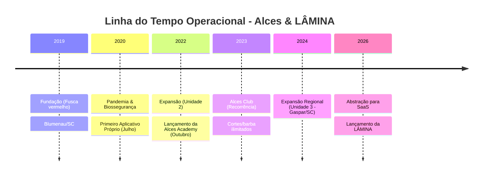
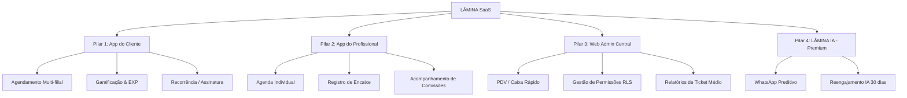

# 🚀 Planejamento Estratégico Master — LÂMINA SaaS
## 🦌 De Barbearia Física a Ecossistema Digital Premium (Por Barbeiros, Para Barbeiros)

---

## 1. Visão Executiva e Origem da Marca

A **LÂMINA** não nasce de suposições corporativas de programadores em uma sala fechada. Ela é a evolução direta da **Alces Barbearia** (Blumenau/SC), um laboratório operacional fundado em 2019 que testou, errou e refinou todos os processos de gestão, atração e recorrência no mundo real.

### Os Founders
*   **Gabriel Nascimento** (Founder & Business Operations): Empreendedor e especialista no setor de beleza masculina com mais de 7 anos de experiência de mercado, fundador da rede Alces Barbearia. Traz a inteligência operacional de negócios, validação prática no ecossistema de salões e a visão de produto focada na jornada do cliente final.
*   **Leonardo Pickler** (Tech Founder & CTO): Engenheiro de Software Sênior/Staff com mais de 16 anos de experiência em engenharia e liderança (.NET/C#, Next.js, React, Node.js, Flutter). Especialista em soluções Web3/Blockchain e fluxos de desenvolvimento potencializados por IA (Agentes LLM, engenharia assistida por IA). Ex-CTO & Co-Founder da Nortech App. Traz maturidade arquitetural e velocidade extrema de entrega ao ecossistema LÂMINA.
*   **Juan Minni** (Co-Founder, Growth & Product Lead): CEO e Founder da Starken Tecnologia. Com mais de 12 anos de experiência em marketing digital, tráfego pago, gestão de e-commerce e branding. Atendeu mais de 100 empresas e gerou mais de R$ 3 milhões em receita para negócios locais. Traz para a LÂMINA a inteligência de growth, estruturação comercial e a direção de experiência estética e conversão do produto.

---

## 2. Storytelling & Linha do Tempo (2019 — 2026)

A história da Alces valida a tese da LÂMINA: **tecnologia dedicada gera fidelidade extrema**.

### Principais Marcos de Validação Tecnológica
1.  **Fundação e Fusca Vermelho (Outubro/2019):** Marca forte, descontraída e focada no cliente.
2.  **O Primeiro Aplicativo (Julho/2020):** Lançado nos primeiros 9 meses. Provou que ter um app próprio (iOS/Android) engajava mais os clientes do que marketplaces que misturam a concorrência.
3.  **Multi-filial Nativo (Agosto/2022):** Validação de rotas de agendamento entre Unidade 1 (Itoupava Seca) e Unidade 2 (Escola Agrícola).
4.  **Alces Club - Recorrência (Setembro/2023):** Cobrança recorrente (R$ 109,90 a R$ 159,90/mês). Garantiu estabilidade financeira, faturamento previsível e maior frequência de visitas à barbearia.

---

## 3. O Ecossistema do Produto (Os 4 Pilares)

---

## 4. O Web Admin & Matriz de Permissões

O **Web Admin** é o painel de gestão central da barbearia. Ele é protegido por níveis de acesso (Row Level Security no banco de dados) para garantir que cada colaborador acesse apenas o que é relevante para seu escopo.

### Níveis de Usuários do Sistema

1.  **🔧 Super Admin (White Label):** Administrador global da plataforma LÂMINA. Gerencia múltiplas barbearias parceiras, altera identidade visual global, comissão global e gerencia domínios.
2.  **👑 Owner (Dono da Barbearia):** Dono de uma barbearia (ou rede multi-filial específica). Tem acesso total ao dashboard financeiro, despesas, configurações de comissão da sua barbearia, gestão de equipe e produtos.
3.  **📊 Manager (Gerente/Gestor):** Operador do dia a dia. Tem acesso a relatórios operacionais, abertura e fechamento de caixa, cadastro de barbeiros e clientes, mas **não altera as configurações estruturais** da loja.
4.  **⭐ Leader (Líder da Tropa):** Barbeiro sênior/líder de filial. Gerencia a escala local, acompanha metas da equipe e comissões da sua equipe, além de operar o caixa operacional.
5.  **✂️ Barber (Profissional):** A visão mais restrita. O barbeiro usa o painel para ver sua própria agenda, acompanhar suas comissões acumuladas e metas individuais.
6.  **👤 Client (Área Pública):** Acesso sem login administrativo para agendamento, compra de produtos e adesão ao clube de assinatura.

### Matriz de Permissões Completa

| Funcionalidade | Super Admin | Owner (Dono) | Manager (Gerente) | Leader (Líder) | Barber (Barbeiro) |
| :--- | :---: | :---: | :---: | :---: | :---: |
| **Gerenciar Múltiplas Lojas (SaaS)** | ✅ | ❌ | ❌ | ❌ | ❌ |
| **Alterar Identidade Visual Global** | ✅ | ❌ | ❌ | ❌ | ❌ |
| **Configurações Estruturais da Loja** | ✅ | ✅ | ❌ | ❌ | ❌ |
| **Visualizar Relatórios Financeiros Globais** | ✅ | ✅ | ✅ | ❌ | ❌ |
| **Cadastrar Serviços e Produtos** | ✅ | ✅ | ✅ | ❌ | ❌ |
| **Gerenciar Comissionamento de Todos** | ✅ | ✅ | ✅ | ❌ | ❌ |
| **Abrir/Fechar Caixa Geral** | ✅ | ✅ | ✅ | ✅ | ❌ |
| **Registrar Vendas/PDV** | ✅ | ✅ | ✅ | ✅ | ✅ (Só Próprio) |
| **Ver Escala de Trabalho Global** | ✅ | ✅ | ✅ | ✅ | ❌ |
| **Ver Própria Agenda/Escala/Comissões** | ✅ | ✅ | ✅ | ✅ | ✅ |

---

## 5. Plano de Transição SaaS (De Monolito a Multi-tenant)

Para transformar a estrutura da Alces em um SaaS global, a arquitetura está sendo modularizada da seguinte forma:

1.  **Multi-tenancy com Supabase:** Inclusão da coluna `tenant_id` em todas as tabelas transacionais (reservas, clientes, comissões). Políticas de RLS habilitadas para restringir a leitura apenas a registros com o `tenant_id` correspondente ao subdomínio ativo.
2.  **Branding Whitelabel Dinâmico:** Frontend Flutter e Web consumindo o Design System via CSS variables e tokens dinâmicos, ajustando as cores de "Precision Dark" para qualquer marca com base no perfil do tenant.
3.  **Gateway Central com Split de Pagamentos:** Configuração do gateway Asaas via API para permitir que o split vá direto para a conta do Owner, com desconto da porcentagem de taxa da plataforma LÂMINA.

---

## 6. Modelo de Negócio

| Plano | Setup (Implementação) | Mensalidade | O que Inclui |
| :--- | :--- | :--- | :--- |
| **Essencial** | R$ 2.500 | R$ 197 / mês | Web Admin + App Whitelabel + Gamificação Base |
| **Pro** | R$ 4.000 | R$ 347 / mês | Essencial + Clube de Assinaturas (Recorrência) + Metas Avançadas |
| **Plus (IA)** | R$ 6.000+ | R$ 597+ / mês | Pro + LÂMINA IA (WhatsApp Assistente Preditivo e Agendador automático) |
